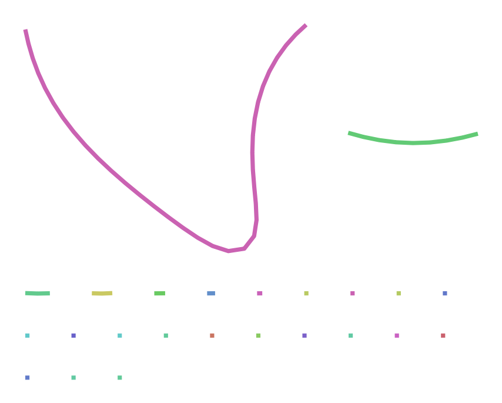

# Objetivo

Ensamblar el genoma de un eucariota diploide con lecturas de PacBio de
alta fidelidad.

# Preparación

Necesitamos instalar el programa `hifiasm` siguiendo los pasos
siguientes en el terminal de Bash. Lo recomendable es instalarlo en una
carpeta `bin` dentro de la carpeta de usuario:

```{bash}
#| eval: false

if [ ! -d ~/bin ]; then mkdir ~/bin; fi
cd ~/bin
git clone https://github.com/chhylp123/hifiasm
cd hifiasm
make
```

Una vez compilado (`make`), el ejecutable `~/bin/hifiasm/hifiasm` estará
disponible, pero no en el PATH (donde Bash pueda encontrarlo), por lo
que hay que añadir la carpeta `~/bin/hifiasm` a éste. En el terminal de
Bash esto se consigue con la orden `export PATH=$PATH:~/bin/hifiasm`,
pero así sólo afecta al terminal en el que se ha ejecutado. Para
modificar el PATH permanentemente hay que incluir esta otra orden en el
script `~/.bashrc`. Se puede hacer automáticamente con la orden
siguiente, pero asegúrate de ejecutarla sólo una vez:

```{bash}
#| eval: false

echo 'export PATH=$PATH:~/bin/hifiasm' >> ~/.bashrc
```

A partir de ahora, cada vez que inicies el terminal `hifiasm` estará en
el PATH, pero el terminal desde el cual has ejecutado la orden anterior
se abrió antes de esta modificación por lo que, para que surta efecto,
puedes actualizarlo sin tener que cerrarlo y volver a abrirlo con la
orden `. ~/.bashrc.`.

También es necesario instalar el programa `compleasm`, que está
programado en Python y depende del módulo `pandas` de Python. En WSL,
este módulo o paquete probablemente pueda instalarse con
`sudo apt install python3-pandas` y, alternativamente, en los sistemas
con `conda` con `conda install pandas` (así es como he tenido que
hacerlo, la primera opción no me funcionó).

Por su parte, instalaremos `compleasm` de la siguiente manera:

```{bash}
#| eval: false

cd ~/bin
wget https://github.com/huangnengCSU/compleasm/releases/download/v0.2.7/compleasm-0.2.7_x64-linux.tar.bz2
tar -jxvf compleasm-0.2.7_x64-linux.tar.bz2
```

# Datos

Vamos a usar lecturas HiFi generadas por Rabanal et al.
([2022](https://aulavirtual.uv.es/pluginfile.php/6018144/mod_resource/content/2/guio-es.html#ref-Rabanal2022))
de un único individuo de la planta *Arabidopsis thaliana*, ecotipo
Columbia (Col-0), con la tecnología SMRT de PacBio (proyecto
[PRJEB50694](https://www.ebi.ac.uk/ena/browser/view/PRJEB50694)). Los
datos seleccionados son solo una parte de los originales y se encuentran
en el archivo `At4.10.fa.gz` (disponible en el aula virtual), el cual
guardaremos en la carpeta `data`, siendo su *path* relativo
`../../data/At4.10.fa.gz`.

# Revisión de los datos

Los datos están en formato FASTA porque contienen sólo lecturas de alta
calidad, y `hifiasm` no utiliza la información de las calidades de cada
base. El archivo está comprimido. Antes de empezar el ensamblaje
deberíamos tener una idea de la cantidad de datos que tenemos:

::: {.callout-note icon="false"}
## Ejercicio 1

-   ¿Cuántas secuencias contiene el archivo?

    Para obtener este dato contaremos cuántas líneas del archivo
    empiezan por `>`, ya que en formato FASTA todas las secuencias están
    precedidas por ese caracter:

    ```{bash}
    zgrep -c "^>" ../../data/At4.10.fa.gz
    ```

-   ¿Qué longitudes mínima, media y máxima tienen las secuencias?

    ```{bash}
    zcat ../../data/At4.10.fa.gz | awk '/^>/ {if(l>0){s+=l;count++;if(l>max)max=l;if(l<min||min==0)min=l}l=0;next}{l+=length($0)}END{if(l>0){s+=l;count++;if(l>max)max=l;if(l<min||min==0)min=l}printf "Mínima: %d\nMedia: %.2f\nMáxima: %d\nTotal Bases: %d\nNum Secuencias: %d\n", min, s/count, max, s, count}'
    ```

-   ¿Cuál es el número total de bases?

    Con el comando del apartado anterior también obtuvimos este dato:
    250599484pb.

-   Si se estimara que el genoma a ensamblar fuera de sólo 19 millones
    de bases, ¿cuál sería la cobertura esperada?

    ```{bash}
    zcat ../../data/At4.10.fa.gz | awk '/^>/ {next} {sum+= length($0)} END {print "Cobertura esperada:" sum/19000000}'
    ```
:::

# Ensamblaje

En primer lugar, crearemos una subcarpeta dentro de nuestra carpeta de
trabajo (en este caso, `2026-04-21`) donde iremos guardando todos los
archivos de salida que genera el programa `hifiasm`. Si fuéramos a
probar más de una estrategia de ensamblado, guardaríamos los resultados
de cada intento en una carpeta diferente y podríamos nombrarlas como
`asm1`, `asm2`, etc. En nuestro caso, aunque sólo vayamos a realizar un
ensamblaje, nuestra carpeta de resultados se llamará `asm1`:

```{bash}
# Con la ejecución condicional nos ahorramos algún mensaje de error:
if [ ! -d asm1 ]; then mkdir asm1; fi
```

El ensamblaje de estas lecturas puede durar unos minutos, por lo que no
es óptimo tener que ejecutarlo cada vez que compilamos el documento de
Quarto. Existen dos opciones: o bien usamos la directriz
`#| cache: true` al principio del bloque de código o bien controlamos
directamente la ejecución condicional con Bash. Si usáramos el método
que ofrece Quarto, aparecería una nueva carpeta que guarda resultados
previos y que estaría bien incluir en el repositorio de Git, pero me
decantaré por usar Bash.

Por tanto, la ejecución de la siguiente línea de código cumple con 2
objetivos:

1.  Generar nuestro ensamblaje utilizando `hifiasm`.
2.  Conseguir que éste no se ejecute cada vez que compilemos el
    documento de Quarto.

```{bash}
export PATH="$PATH:$HOME/bin/hifiasm"
if [ ! -e asm1/At4.bp.p_ctg.gfa ]; then
   hifiasm -o asm1/At4 -t 2 -f 0 ../../data/At4.10.fa.gz 2> asm1/hifiasm.log
fi
```

Se habrán generado muchos archivos de salida de `hifiasm` dentro de la
carpeta `asm1`, pero es el archivo `At4.bp.p_ctg.gfa` el que contiene
los contigs y se puede transformar a formato FASTA si fuera necesario.

Los parámetros utilizados significan lo siguiente:

-   `-o asm1/At4`: usa el prefijo `asm1/At4` para los archivos de
    salida.

-   `-t 2`: usa dos procesadores. Por defecto usaría uno.

-   `-f 0`: inhabilita el uso de un filtro de Bloom durante la
    corrección de errores, que ocuparía 16 Gb de memoria.

-   `../../data/At4.10.fa.gz`: archivo con los datos de entrada.

-   `2> asm1/hifiasm.log`: guarda los numerosos mensajes que `hifiasm`
    envía al *error estándar* en un archivo `asm1/hifiasm.log`. Esto
    evita que esos mensajes se acumulen en el informe HTML.

::: {.callout-note icon="false"}
## Ejercicio 2

Consulta la ayuda de `hifiasm` (`hifiasm -h`) y contesta las preguntas
siguientes:

1.  ¿Los parámetros corresponden al ensamblaje de un genoma haploide o
    diploide?

    Se corresponden a un ensamblaje diploide porque no hemos utilizado
    ningún parámetro que le especifique de forma explícita a `hifiasm`
    que fuerce un ensamblaje haploide, de modo que, por defecto, el
    programa asume que se trata de un genoma diploide y genera dos
    archivos de salida (`At4.bp.hap1.p_ctg.gfa` y
    `At4.bp.hap2.p_ctg.gfa`) con los dos haplotipos del genoma.

2.  ¿Qué nivel de eliminación de duplicaciones hemos aplicado? (El paso
    de eliminar duplicaciones sirve para que las zonas de alta
    heterocigosidad no sean ensambladas como contigs diferentes).

    En nuestro comando no hemos especificado ningún parámetro de
    eliminación explícita de duplicados (como podría ser `-l`) pero
    `hifiasm`, al estar diseñado para genomas diploides, incorpora de
    forma automática mecanismos para gestionar la heterocigosidad y
    evitar que estas zonas se ensamblen como contigs independientes.

3.  Si tuvieramos lecturas ultra-largas, ¿con qué opción o argumento
    añadiríamos esa información?

    Para indicarle a `hifiasm` que nuestras lecturas HiFi no son
    normales sino ultra-largas (*ultra-long reads*), tendríamos que
    añadir el argumento `--ul` en nuestro código. De este modo, el
    ensamblador sabrá que tiene que adaptar el procesamiento a este tipo
    de lecturas, caracterizadas por su mayor tasa de error.
:::

# Evaluación del resultado

::: {.callout-note icon="false"}
## Ejercicio 3

Consulta la descripción de los archivos de salida que encontrarás en
[este
enlace](https://hifiasm.readthedocs.io/en/latest/interpreting-output.html)
y contesta las preguntas siguientes:

1.  ¿Dónde están las secuencias que componen el ensamblaje?

    Se encuentran en el archivo de salida `"prefix".p_ctg.gfa` generado
    por `hifiasm`, que en nuestro caso sería `At4.bp.p_ctg.gfa`.

2.  En los archivos `.gfa`, ¿qué son las líneas que empiezan por ‘A’?

    Son líneas que incluyen información sobre las lecturas utilizadas
    para construir el contig/unitig.

3.  ¿Qué información tiene los archivos `.bed`?

    Contienen las coordenadas de las regiones con baja calidad.

4.  ¿Cuál es la cobertura media estimada de las secuencias homocigotas?

    Este dato se consigue en el archivo `hifiasm.log`, en la línea
    `"homozygous read coverage threshold: X"`. Al buscarlo, vemos que la
    cobertura media de secuencias homocigotas en nuestro ensamblaje fue
    de 12.

    Este dato también se corresponde con el pico alto del histograma de
    k-mers (`peak_hom: 12`).

5.  ¿Y la de las heterocigotas?

    La cobertura media de estas secuencias se corresponde al pico de
    menor valor en el ya mencionado histograma de k-mers el cual, si lo
    buscamos en el archivo `hifiasm.log`, es de -1 (`peak_het: -1`).
:::

Los ensamblajes primario y por haplotipos se presentan en formato
[GFA](https://github.com/GFA-spec/GFA-spec/tree/master). Para extraer
las secuencias en formato FASTA podemos usar el pequeño *script*
siguiente, en lenguaje
[AWK](https://www.gnu.org/software/gawk/manual/gawk.html), desde el
terminal de Bash:

```{bash}
awk '(/^S/){print ">" $2 "\n" $3}' asm1/At4.bp.p_ctg.gfa > asm1/At4.fa
```

## Calidad del ensamblaje

Hemos instalado con anterioridad `compleasm` y suponemos que
`compleasm.py` está en `~/bin/compleasm_kit`. Ahora, el programa
necesita descargar la lista de genes típica del linaje al que pertenece
el ensamblaje. En nuestro caso, el linaje es el de las Brassicales.

::: callout-caution
La orden siguiente puede tomar más de 10 minutos.
:::

```{bash}
#| eval: false

if [ ! -e asm1_eval/summary.txt ]; then
   python3 ~/bin/compleasm_kit/compleasm.py run \
      -t 2 -l brassicales -a asm1/At4.fa -o asm1_eval
fi
```

::: {.callout-note icon="false"}
## Ejercicio 4

Consulta la ayuda de `compleasm.py` y averigua qué significan los
argumentos utilizados.

-   `-t 2`: indica el número de procesadores que debe utilizar el
    programa para acelerar el análisis.

-   `-l brassicales`: es el orden al que pertenece *Arabidopsis
    thaliana*. Así le indicamos al programa en qué grupo debe buscar los
    genes para evaluar la calidad del ensamblaje.

-   `-a asm1/At4.fa`: es el archivo de entrada.

-   `-o asm1_eval`: es el archivo de salida.
:::

::: callout-important
## Aclaración

Conseguí instalar correctamente el módulo `pandas` para Python y el
programa `compleasm` pero la ejecución del bloque de código anterior
estuvo más de 1 hora en curso y no llegó hasta el final, así que no pude
conseguir el archivo `summary.txt`.
:::

## Visualización del grafo

Desafortunadamente, no existe todavía ningún paquete de R para
visualizar ensamblajes como grafos de fragmentos a partir de archivos
`.gfa`. Uno de los visualizadores más populares es
[bandage](https://rrwick.github.io/Bandage/), una aplicación gráfica que
puede instalarse fácilmente en cualquier sistema operativo, pero que no
ofrece interfaz por línea de comandos.

::: {.callout-note icon="false"}
## Ejercicio 5

Instala `bandage`, carga el grafo del ensamblaje realizado y genera una
figura. Puedes añadir la figura al informe HTML mediante la [sintaxis
siguiente](https://quarto.org/docs/authoring/figures.html):

```         
, en mi caso: 


```


:::
